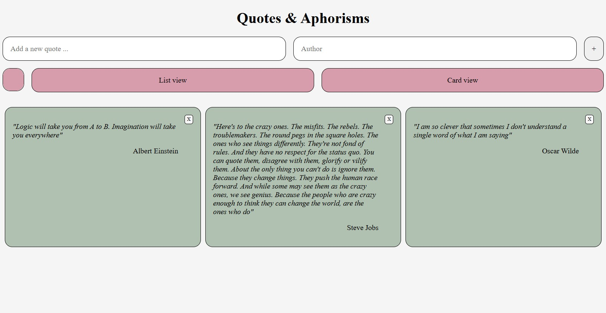

# Assigment 01

## Brief

Starting from the concept of a pinboard, implement a web page that:

- is responsive (properly layout for smartphone, tablet, and desktop)
- allows the user to add and remove elements
- allows the user to coustomize elements (i.e. colors, size)
- allows the switch between two views (at least)

## Screenshots

## Project description

A website where you can pin down your favourite quotes, with the author.
The view can change between a card view and a list view thanks to the two buttons, that can also change their colors.

## List function
- input type text to write the quote
- input type text to write the author
- input type color to change the button colors
- button + to add a new element to the list
- button list view to visualize the list view
- button card view to visualize the card view
- x button to remove the elements