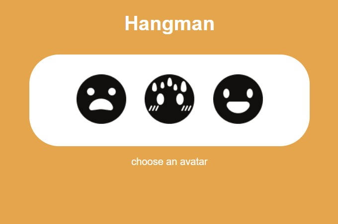
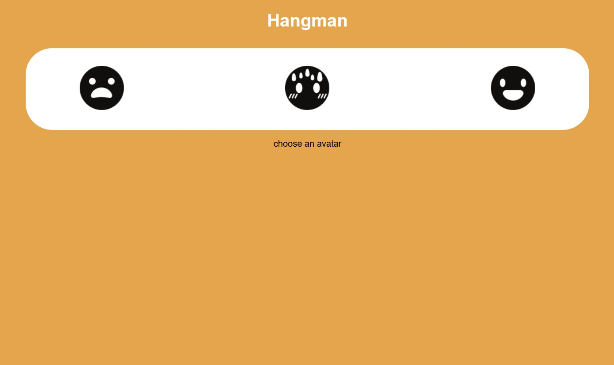
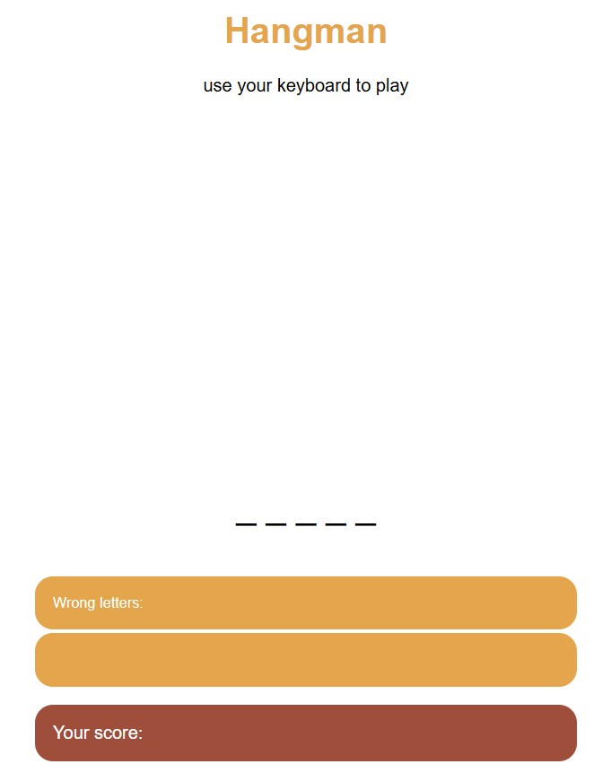
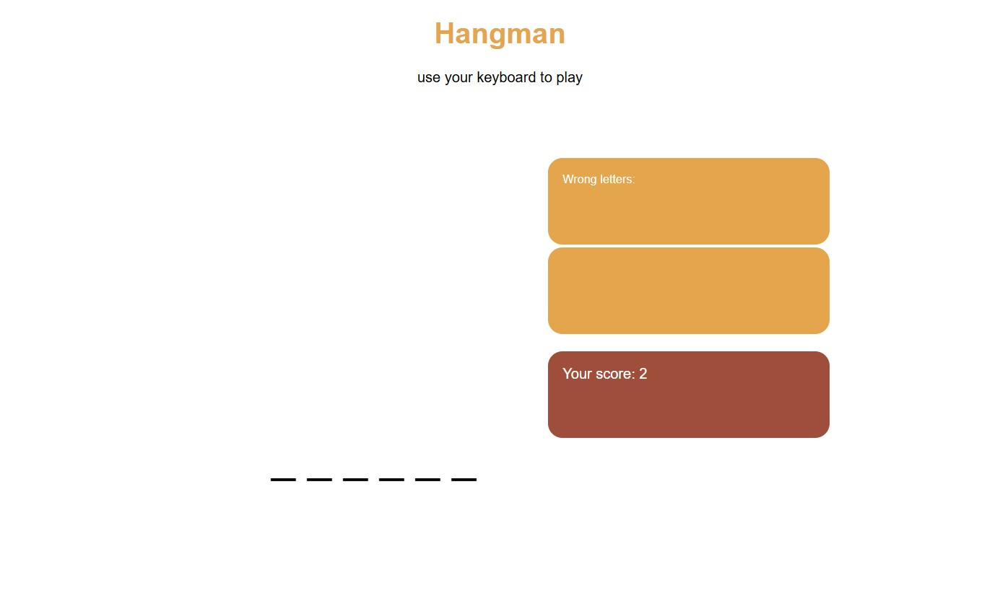
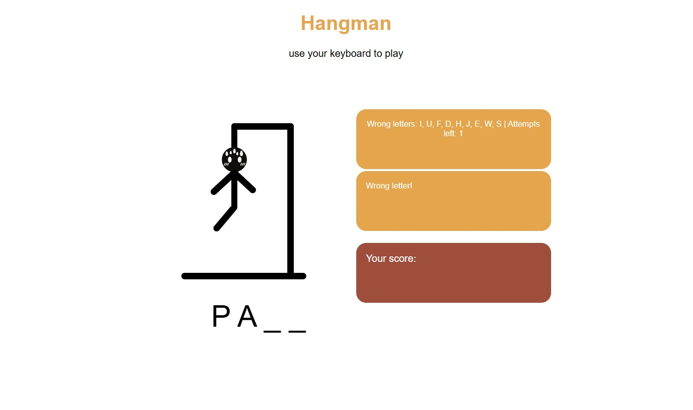
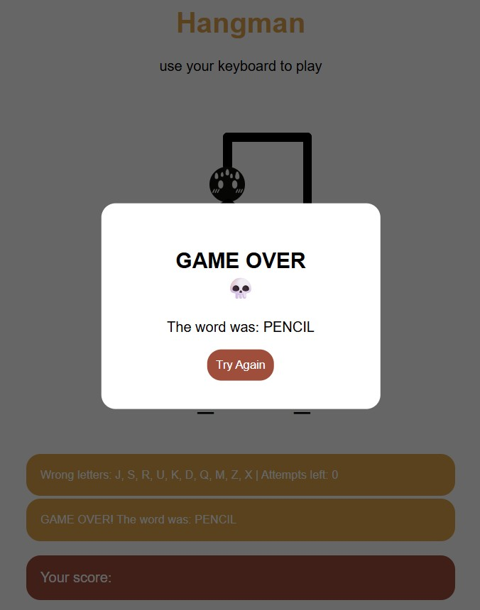
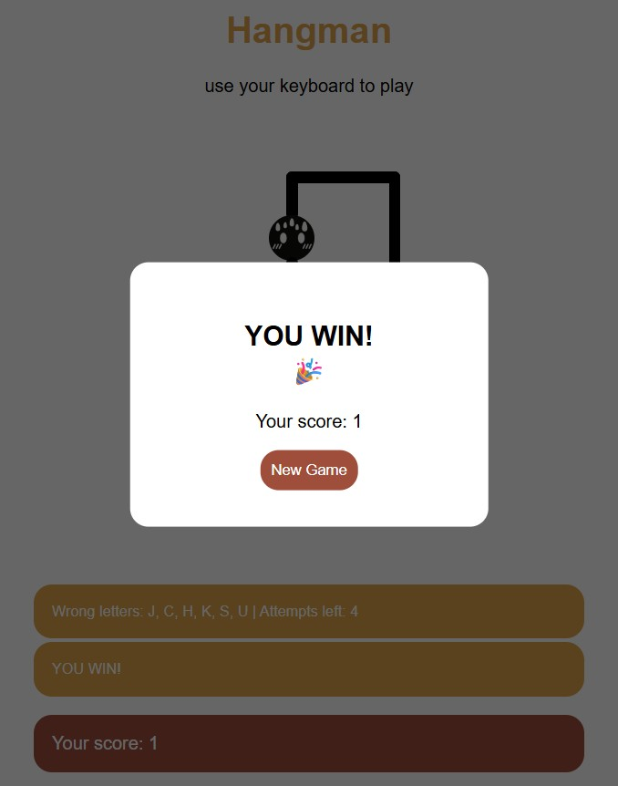

# Hangman

## Brief
Choose a “mini-game” to rebuild with HTML, CSS and JavaScript. The requirements are:

- The webpage should be responsive
- Choose an avatar at the beginning of the game
- Keep track of the score of the player
- Use the keyboard to control the game (indicate what are the controls in the page). You can also use buttons (mouse), but also keyboard.
- Use some multimedia files (audio, video, …)
- Implement an “automatic restart” in the game (that is not done via the refresh of the page)

## Project description
The hangman mini-game is inspired to the hangman game everyone has played as a children on paper.
In the real game there are two player: one has to guess the world chosen by the other player by the number of letters and with some trial and error on the letters. Every error means a step further hanging the man, while every correct attempt means knowing that letter of the word and I'm which place it is.

In this project there is only one player, the one that have to guess which is the right word pressing the letters on the keyboard in order to obtain that word.
The word is chosen in a random way and the user can only find out if a letter is present in word by pressing it on the keyboard.
There are 10 attempts before the game is over, those are the steps to build the hang and hanging the man.
After that or when the player guesses the right word before finishing the attempts, the game is over and the player has to start a new one, with a new word.

## Screenshots

## Flowchart

## Function list

### handleKeyPress(event)
Checs for the letters that are used to guess the right word

### changeAvatar(avatarNumber)
Allows the choice between the three version of the hangman face befor actually starting the game

### initializeGame()
Makes the game start extracting a random word calling the function:

#### randomNumber()
It picks a randomic number in a choosen gap with a maximum

### document.addEventListener('keydown')
It checks for key pressed to show the correct and wrong letters thanks to the following functions:

#### updateWordDisplay()
Shows the correct letters in their place inside the word calling the function:

##### handleGuess(letter)
Confront the letters to find out if they are correct or not, if not a part of the hangman is drawn.

#### updateWrongLetterDisplay()
Shows the wrong letters that have been pressed and the left attempts to guess the word

#### checkGameStatus() 
Checks if all the blanck spaces for the letters are filled to show the pop-up calling the function:

##### showPopup("win")
Shows the pop-up YOU WIN! if all the blanck spaces are filled with letters and allow a new game

##### showPopup("lose")
Shows the pop-up GAME OVER if you have no more attempts so you can start a new game

##### hidePopups()
Hide the pop-ups previously shown

### drawHangmanPart(errorCount)
Shows a part of the Hangman with every increasing error