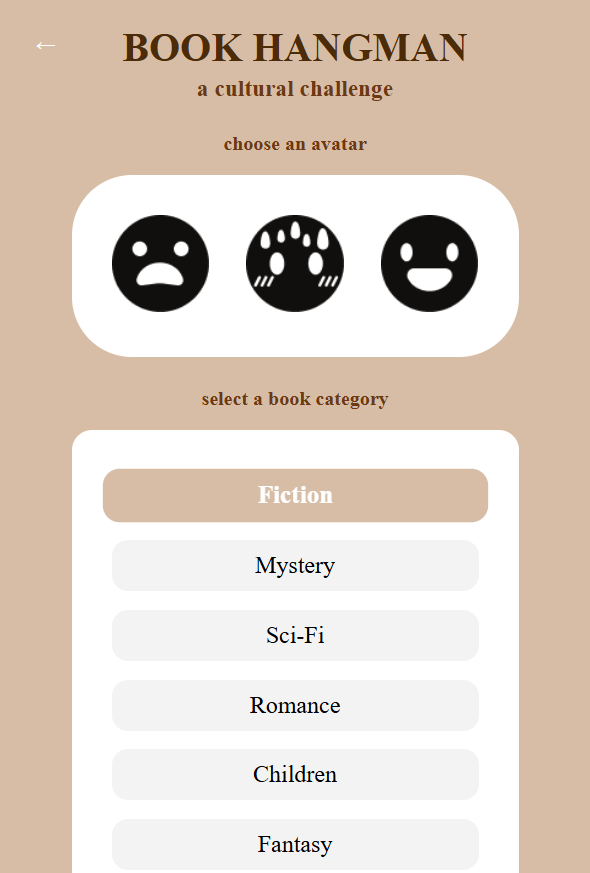
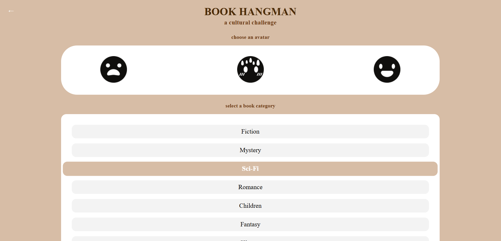
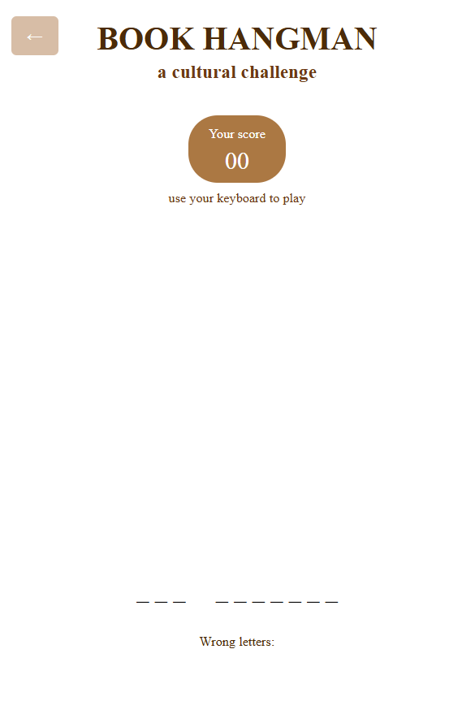
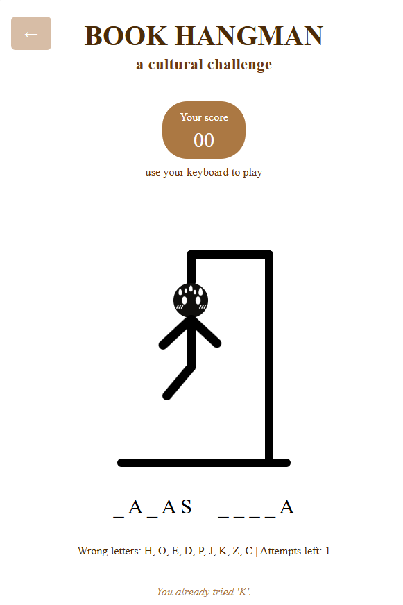
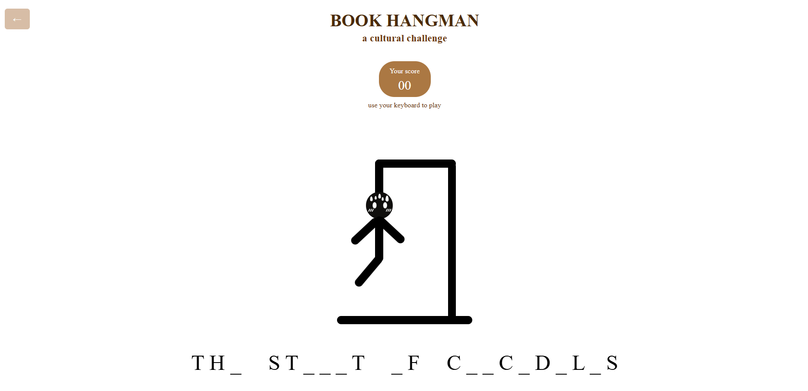
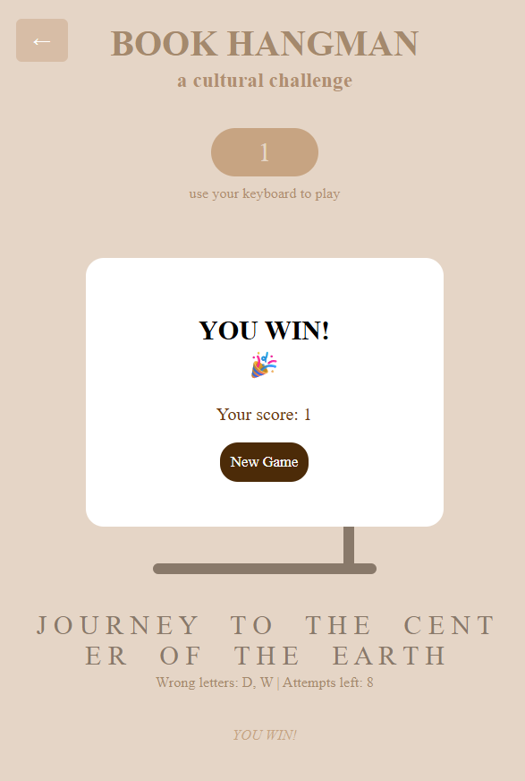
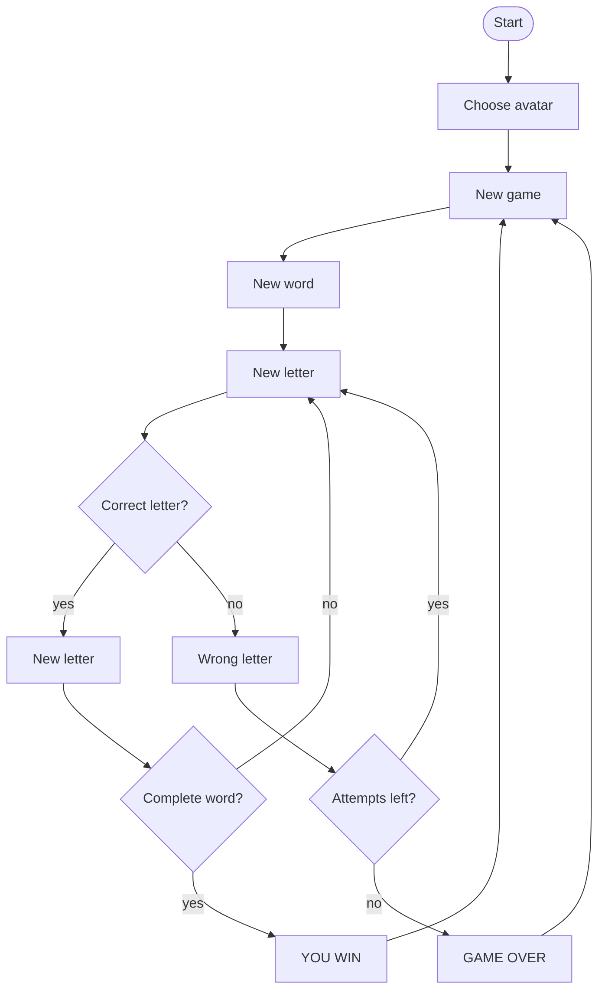

# Hangman

## Brief
Upgrade the **Assignment 02** by adding the use of data coming from an external web API. For example, fetch contents (audio, images, video, text, metadata) from online archives, AI generated contents (chatGPT API), data (weather, realtime traffic data, environmental data).

Have a look at the lesson about the API:

[https://wind-submarine-3d4.notion.site/Lesson-5-200d516637bc811aba69e13b0ffe438f?pvs=74](https://www.notion.so/200d516637bc811aba69e13b0ffe438f?pvs=21)

The application **must** have those requirements:

- The webpage is responsive
- Use a web API (you choose which one best fists for your project) to load the data and display them in the webpage
- At least one multimedia file (for user feedback interactions, or content itself)
- Develop a navigation system that allows the user to navigate different sections with related content and functionalities

## Project description
Book hangman is a mini-game inspired to the hangman game everyone has played as a children on paper.
In the real game there are two player: one has to guess the world chosen by the other player by the number of letters and with some trial and error on the letters. Every error means a step further hanging the man, while every correct attempt means knowing that letter of the word and I'm which place it is.

In this project there is only one player, the one that have to guess which is the right book title from a chosen category pressing the letters on the keyboard in order to obtain the correct title. 
Letters are guessed via keyboard, and each wrong guess draws a part of the hangman. The game automatically shows win/lose popups and can restart without refreshing the page.
## Screenshots

## Flowchart

## Function list

### initializeGame()

Starts a new game, fetches a random book title from the selected category, and resets correct and wrong letters.

### fetchBookTitle(callback)

Calls the Google Books API to get a random book title from the selected category. The callback receives the cleaned book title.

### handleKeyPress(event)

Handles keyboard input and sends the pressed letter to handleGuess().

### handleGuess(letter)

Checks if the guessed letter is in the word. Updates the correct/incorrect letters display and draws hangman parts if needed.

### updateWordDisplay()

Displays the word with correctly guessed letters in their correct positions.

### updateWrongLetterDisplay()

Updates the wrong letters display and remaining attempts. Plays fail sound on incorrect guess.

### checkGameStatus()

Checks whether the player has won or lost. Shows the appropriate popup and stops further input.

### drawHangmanPart(errorCount)

Reveals the hangman part corresponding to the current number of wrong guesses.

### showPopup(type)

Shows the win or lose popup.
type: "win" or "lose"

### hidePopups()

Hides all popups and overlay.

## Content and data sources
[Fail sound](https://pixabay.com/sound-effects/fail-234710/)

## API key documentation
[API key](https://console.cloud.google.com/apis/credentials?project=oceanic-airway-480014-c9)